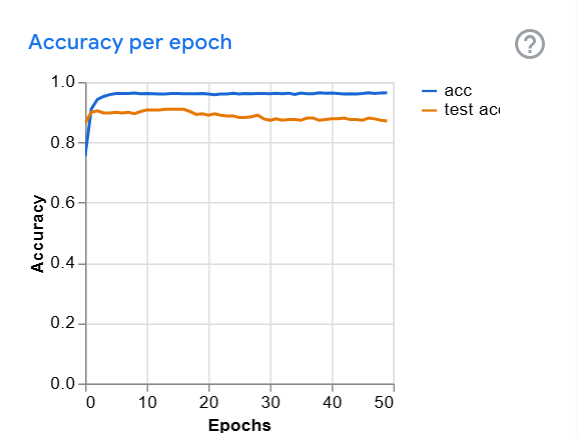
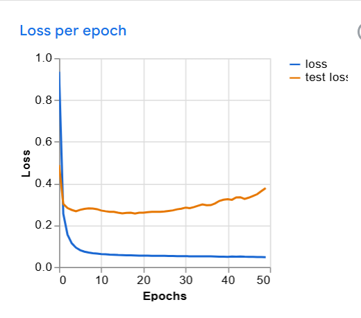

# Plant Species Image Classification

## A. Project Overview
This project is an image classification model designed to recognize 20 different species of flowers. Using a dataset of 5,000 images, the model was trained to distinguish between various floral structures, petal patterns, and colors. This tool can be used by gardeners or botany students to quickly identify common ornamental and wild flowers.

# Plant Species Gallery

## B. Plant Species Gallery

| Common Name | Scientific Name | Description | Image
| :--- | :--- | :--- | :--- |
| Anthurium | *Anthurium andraeanum* | Glossy, heart-shaped red bracts with a yellow spadix. ||
| Barbeton Daisy | *Gerbera jamesonii* | Large, brightly colored daisy-like flowers. ||
| Bougainvillea | *Bougainvillea glabra* | Woody vines with vibrant, paper-like colorful bracts. | |
| Californian Poppy | *Eschscholzia californica* | Brilliant orange cup-shaped flowers. | |
| Camellia | *Camellia japonica* | Symmetrical, rose-like flowers with glossy leaves. | |
| Cape Flower | *Tecoma capensis* | Clusters of tubular, trumpet-like orange blooms. | |
| Clematis | *Clematis viticella* | Large, star-shaped purple or pink climbing flowers. | |
| Cyclamen | *Cyclamen persicum* | Unique swept-back petals that point upwards. | |
| Geranium | *Pelargonium* | Clusters of small, five-petaled flowers on long stalks. | |
| Hibiscus | *Hibiscus rosa-sinensis* | Large trumpet-shaped blooms with a long stamen. | |
| Lotus | *Nelumbo nucifera* | Large, multi-petaled aquatic flowers. | |
| Morning Glory | *Ipomoea purpurea* | Funnel-shaped flowers that bloom in early morning. | |
| Passion Flower | *Passiflora edulis* | Complex flowers with a unique "fringe" of filaments. | |
| Petunia | *Petunia × atkinsiana* | Trumpet-shaped flowers in a wide variety of colors. | |
| Pink Yellow Dahlia | *Dahlia pinnata* | Multi-layered geometric petals in sunset gradients. | |
| Sunflower | *Helianthus annuus* | Huge yellow ray flowers with a dark central disc. | |
| Sweet William | *Dianthus barbatus* | Small, fringed flowers in dense, flat-topped clusters. | |
| Sword Lily | *Gladiolus* | Tall spikes of ruffled, trumpet-shaped flowers. | |
| Thorn Apple | *Datura stramonium* | Large, white upright trumpet flowers with spiky pods. ||
| Wallflower | *Erysimum cheiri* | Fragrant, four-petaled flowers in warm earth tones. | |

## C. Model Training Details
- **Total Images:** 2,689 (Distributed across 20 classes)
- **Average Images per Class:** ~134 images (Note: some classes have more/less than others)
- **Epochs:** 100
- **Batch Size:** 64
- **Learning Rate:** 0.001

## D. Model Evaluation

## E. Model Testing

Below are 10 tests performed using images the model had not seen during training. These results demonstrate the model's ability to generalize and accurately identify plant species in various conditions.

---

### Test 1: Cyclamen
- **Result:** Correct
- **Confidence:** 96%

### Test 2: Geranium
- **Result:** Correct
- **Confidence:** 95%

### Test 3: Hibiscus
- **Result:** Correct
- **Confidence:** 99%

### Test 4: Anthurium
- **Result:** Correct
- **Confidence:** 96%

### Test 5: Barbeton Daisy
- **Result:** Correct
- **Confidence:** 97%

### Test 6: Bougainvillea
- **Result:** Correct
- **Confidence:** 99%

### Test 7: Californian Poppy
- **Result:** Correct
- **Confidence:** 100%

### Test 8: Camellia
- **Result:** Correct
- **Confidence:** 100%

### Test 9: Cape Flower
- **Result:** Correct
- **Confidence:** 96%

### Test 10: Clematis
- **Result:** Correct
- **Confidence:** 98%

---
